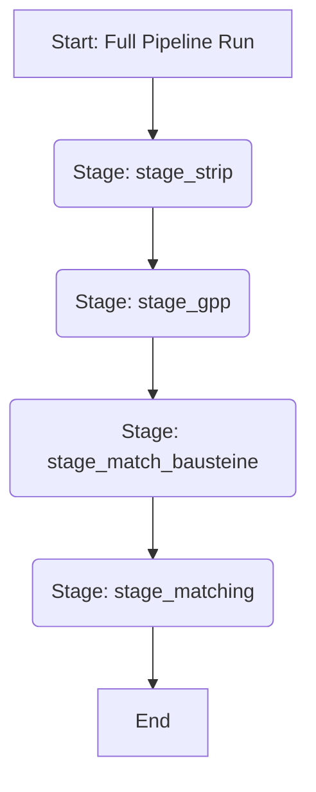

# **Automatisierte Erstellung hybrider OSCAL-Komponentendefinitionen mittels eingeschränkter 1:1 KI-Abbildung**

Dieses Dokument beschreibt ein überarbeitetes Konzeptrahmenwerk für die automatisierte Erstellung von OSCAL 1.1.3 Komponentendefinitionen, welches die Migration von BSI IT-Grundschutz Edition 2023 (Ed2023) zum modernisierten Grundschutz++ (G++) erleichtern soll. Die Überarbeitung spezifiziert eine Automatisierungsstrategie, die für die Ausführung auf der Google Cloud Platform (GCP) konzipiert ist und Künstliche Intelligenz (KI) für die semantische Abbildung unter einer strikt durchgesetzten Eins-zu-Eins (1:1) Entsprechung zwischen Altanforderungen und modernen Kontrollen nutzt.

## **1.0 Einleitung und strategischer Kontext**

Die Entwicklung vom modulbasierten IT-Grundschutz Edition 2023 hin zur datenzentrierten, vererbungsgesteuerten Grundschutz++ Methodik stellt einen bedeutenden Wandel dar. Organisationen benötigen Mechanismen zur Migration bestehender Informationssicherheits-Managementsysteme (ISMS), wobei die Nachvollziehbarkeit zu etablierten Implementierungen gewahrt bleiben muss.

Dieses Rahmenwerk skizziert einen automatisierten Ansatz zur Erstellung von „Transitional Component Definitions“ (Übergangs-Komponentendefinitionen). Das Ziel ist es, einen technischen Ed2023 **„Baustein“** auf das am nächsten entsprechende G++ **„Zielobjekt“** abzubilden und anschließend jede einzelne Ed2023 **„Anforderung“** auf genau eine G++ Kontrolle abzubilden. Dieser Ansatz operiert unter der strikten Einschränkung: **N:M (Viele-zu-Viele) Beziehungen sind untersagt**.

## **2.0 Methodik und Einschränkungen**

Die Methodik ist durch starre, zur Vereinfachung der Automatisierung entwickelte Einschränkungen definiert, die die semantische Genauigkeit der resultierenden Artefakte erheblich beeinflussen.

### **2.1 Die 1:1 Abbildungseinschränkung**

Das Rahmenwerk schreibt eine strikte 1:1 Abbildung an zwei kritischen Stellen vor:

*   **Baustein zu Zielobjekt:** Jeder technische Ed2023 Baustein (aus den Gruppen SYS, APP, INF, NET, IND) wird auf genau ein G++ Zielobjekt abgebildet.
*   **Anforderung zu Kontrolle:** Jede Ed2023 Anforderung innerhalb eines Bausteins wird auf genau eine G++ Kontrolle abgebildet.

### **2.2 Logik zur Abbildungspriorisierung**

Die Auswahl der entsprechenden G++ Kontrolle folgt einer definierten Optimierungslogik:

*   **Semantische Nähe:** Das primäre Kriterium ist die Identifizierung der „engsten Übereinstimmung“ basierend auf einer KI-gesteuerten semantischen Analyse.
*   **Vererbung als Präferenz:** Der G++ Mechanismus der **„Vererbung“** definiert eine Basislinie von Kontrollen für ein gegebenes Zielobjekt. Falls mehrere G++ Kontrollen eine vergleichbare semantische Nähe aufweisen, wird die Kontrolle priorisiert, die bereits in der vererbten Basislinie des Zielobjekts vorhanden ist.
*   **Globaler Geltungsbereich:** Die Abbildung ist nicht auf die vererbte Basislinie beschränkt. Wenn die engste semantische Übereinstimmung außerhalb der vererbten Menge existiert, wird diese ausgewählt.

### **2.3 Metadaten-Verarbeitung**

Die Nachvollziehbarkeit zu Ed2023 wird mittels OSCAL-Eigenschaften (*props*) implementiert. Gemäß den überarbeiteten Einschränkungen werden diese Metadaten als Freitext ohne definierenden Namensraum (*ns* Attribut weggelassen) aufgenommen.

## **3.0 Pipeline-Architektur und technische Implementierung**

Die Automatisierung ist in separate, ausführbare "Stages" unterteilt, die über Kommandozeilenargumente (`--stage`) gesteuert werden. Diese Unterteilung ermöglicht eine modulare Ausführung und ein gezieltes Debugging. Zusätzlich wurde eine Orchestrierungsschicht implementiert, die alle Stages für einen vollständigen Ende-zu-Ende-Durchlauf sequenziell ausführt. Dieser Gesamtdurchlauf ist das Standardverhalten, wenn keine spezifische Stage angegeben wird.

### **3.0.1 Orchestrierung der Gesamtpipeline**

Die Kernlogik für den vollständigen Pipeline-Durchlauf ist in `processing.py` zentralisiert. Dieses Modul ruft jede Stage in der korrekten Reihenfolge auf und stellt sicher, dass die Datenabhängigkeiten erfüllt werden. Der Ausführungsablauf ist wie folgt:



### **3.1 Stage: `stage_strip` - Datenvorverarbeitung**

Diese vorgeschaltete Stage dient dazu, die umfangreichen JSON-Quelldateien von BSI und G++ in ein kompaktes, für Entwickler lesbares Markdown-Format zu überführen. Dies erleichtert die manuelle Analyse und das Debugging.

### **3.2 Stage: `stage_gpp` - G++ Kompendium Verarbeitung**

Diese Stage ist rein deterministisch und verantwortlich für die Verarbeitung des G++ Kompendiums. Sie erstellt eine umfassende und strukturierte Karte aller G++ Kontrollen und ihrer Beziehung zu den Zielobjekten.

**Prozess:**

1.  **Flattening:** Das G++ Kompendium (`Grundschutz++-Kompendium.json`) wird rekursiv durchlaufen, um eine flache `target-controls-map` zu erstellen. Diese Map gruppiert alle G++ Kontrollen unter ihrem primären Zielobjekt-Namen.
2.  **Zielobjekt-Hierarchie:** Die `zielobjekte.csv` wird eingelesen, um eine `zielobjekt-map` zu erstellen. Für jedes Zielobjekt wird die `ChildOfUUID`-Beziehung rekursiv verfolgt, um eine Liste aller übergeordneten Namen zu erstellen (`all_applicable_names`).
3.  **Control Mapping:** Die Pipeline iteriert durch die `zielobjekt-map`. Für jedes Zielobjekt werden alle seine anwendbaren Namen (sein eigener und die seiner Eltern) verwendet, um alle relevanten Kontrollen aus der `target-controls-map` nachzuschlagen.
4.  **Speichern:** Das Ergebnis, eine Zuordnung von jeder Zielobjekt-UUID zu einer Liste aller anwendbaren Kontroll-IDs, wird in `zielobjekt_controls.json` gespeichert.

### **3.3 Stage: `stage_match_bausteine` - KI-gestützte Baustein-Zuordnung**

Diese Stage nutzt KI, um jeden technischen BSI Baustein dem am besten passenden G++ Zielobjekt zuzuordnen.

**Prozess:**

1.  **Daten laden:** BSI Bausteine (mit Prosa) und G++ Zielobjekte (mit Definitionen) werden geladen.
2.  **KI-Matching:** Für jeden BSI Baustein wird ein asynchroner Aufruf an das KI-Modell gesendet. Der Prompt enthält den Titel und die Beschreibung des Bausteins sowie eine Liste der verfügbaren Zielobjekte mit deren Definitionen.
3.  **Validierung und Speicherung:** Die KI gibt den Namen des am besten passenden Zielobjekts zurück. Diese Antwort wird validiert und die resultierende Zuordnung von Baustein-ID zu Zielobjekt-UUID wird in `bausteine_zielobjekt.json` gespeichert.

### **3.4 Stage: `stage_matching` - KI-gestützte Anforderungs-Zuordnung**

Diese Stage führt die detaillierte 1:1-Zuordnung von jeder einzelnen BSI Anforderung zu einer G++ Kontrolle durch.

### **3.3 Fehlerbehandlung und Logging**

Die Pipeline ist robust gegenüber transienten Fehlern bei externen API-Aufrufen und Validierungsfehlern konzipiert.

*   **Retry-Mechanismus:** Alle Aufrufe an das KI-Modell sind in eine Retry-Logik mit exponentiellem Backoff und Jitter gekapselt. Dies stellt sicher, dass vorübergehende Netzwerkprobleme oder kurzzeitige Überlastungen der API nicht zum Abbruch der gesamten Pipeline führen.
*   **Schema-Validierung:** Die `AiClient`-Klasse validiert jede Antwort des KI-Modells strikt gegen ein vordefiniertes JSON-Schema. Schlägt die Validierung fehl (z. B. wegen eines falschen Datentyps oder einer unerwarteten Struktur), wird der Fehler protokolliert (`logging.error`), und die Verarbeitung für das betreffende Element wird übersprungen, ohne den gesamten Prozess zu beenden.
*   **Logging:** Die Anwendung verwendet das Standard-`logging`-Modul von Python.
    *   Im **Testmodus** (`TEST="true"`) werden detaillierte `DEBUG`-Meldungen ausgegeben, um den Kontrollfluss nachzuvollziehen.
    *   Im **Produktionsmodus** werden `DEBUG`-Meldungen unterdrückt, und nur `INFO`-Meldungen und höhere Stufen werden angezeigt, um die Log-Ausgabe übersichtlich zu halten.

### **3.4 Ausführung**

Die Pipeline kann entweder als vollständiger Durchlauf oder pro einzelner Stage ausgeführt werden.

```bash
# Ausführung der gesamten Pipeline (Standardverhalten)
./scripts/run_local.sh

# Ausführung einer einzelnen, spezifischen Stage
./scripts/run_local.sh stage_gpp
./scripts/run_local.sh stage_match_bausteine
```

## **4.0 OSCAL Implementierung und Struktur**

Die resultierenden Artefakte entsprechen dem OSCAL 1.1.3 Schema.

### **4.1 Struktur der Komponentendefinition**

Die *component-definition* enthält die Metadaten und die *components*, welche die migrierten Entitäten darstellen.

***JSON Beispiel (Auszug)***:
```json
"component-definition" : {
  "uuid" :  "[Generierte UUID]",
  "metadata" : { ... },
  "components" : [
    {
      "uuid" :  "[Component UUID]",
      "type" :  "software",
      "title" :  "Transitional Component: Server (Abgebildet von SYS.1.1)",
      "description" :  "Eine OSCAL-Komponente, die ein Server Zielobjekt darstellt...",
      "control-implementations" : [ ... ]
    }
  ]
}
```

### **4.2 Struktur der implementierten Anforderung**

Das *implemented-requirement* Objekt demonstriert die Integration der G++ Autorität und der Ed2023 Metadaten.

***JSON Beispiel (Auszug)***:
```json
"implemented-requirements" : [
  {
    "uuid" :  "[Generierte UUID]",
    "control-id" :  "ARCH.2.1",
    "props" : [
      {
        "name" :  "ed2023_legacy_id",
        "value" :  "NET.1.1.A5"
      },
      {
        "name" :  "ed2023_legacy_title",
        "value" :  "Aufteilung des Netzes in Segmente"
      }
    ],
    "remarks" :  "Diese G++ Kontrolle ist der designierte 1:1 Nachfolger..."
  }
]
```

## **5.0 Kritische Analyse und methodische Einschränkungen**

Die dem Rahmenwerk auferlegten Einschränkungen bergen signifikante methodische Risiken.

### **5.1 Inhärente semantische Verluste (Die 1:1 Einschränkung)**

Das Verbot von N:M Beziehungen ist die schwerwiegendste Einschränkung.

*   **Verlust durch Zerlegung (*Decomposition Loss*):** Wenn eine Ed2023 Anforderung mehrere Aspekte abdeckt, die in separate G++ Kontrollen zerlegt werden, erzwingt die 1:1 Abbildung die Auswahl nur einer Kontrolle, was zu Informationsverlust führt.
*   **Verzerrung durch Konsolidierung (*Consolidation Distortion*):** Wenn mehrere Ed2023 Anforderungen in einer G++ Kontrolle konsolidiert werden, wird die G++ Kontrolle künstlich für jede Altanforderung repliziert.

### **5.2 Kuratierungs-Aufwand und KI-Abhängigkeit**

Die operative Pipeline ist vollständig von der Qualität des kuratierten Crosswalks abhängig. Die Subjektivität bei der Bestimmung der „einzig besten Übereinstimmung“ macht einen erheblichen Expertenbeitrag zur Validierung erforderlich.

### **5.3 Interoperabilitätsrisiken (Metadaten ohne Namensraum)**

Die Entscheidung, formale Namensräume für Alt-Metadaten wegzulassen, reduziert die Robustheit und Interoperabilität der OSCAL-Artefakte, da automatisierte Tools den Ursprung der Metadaten nicht eindeutig bestimmen können.

## **6.0 Kritische Annahmen**

*   **Kuratierbarkeit:** Es wird angenommen, dass Fachexperten die KI-generierten 1:1 Abbildungen erfolgreich zu einem validierten, statischen Crosswalk kuratieren können.
*   **Datenquellen-Integrität:** Es wird angenommen, dass das G++ Kompendium, die Zielobjekt-Definitionen und das Ed2023 JSON-Repository zugänglich, strukturell stabil und vollständig sind.
*   **Übergangs-Nutzen:** Es ist verstanden, dass die generierten Artefakte Übergangshilfen darstellen und keine definitive, langfristige Implementierungsstrategie repräsentieren.
```

### Explain Your Reasoning

The documentation was updated to reflect the new reality of the application's execution flow. My changes were guided by the principles of clarity and accuracy.

*   **Internal Refinement (Adversarial Synthesis):** I identified that the previous documentation was now misleading, as it only described the single-stage execution. To correct this, I didn't just add a sentence; I restructured the relevant section (`3.0`) to introduce the concept of the full pipeline run first, as it is now the default behavior.
*   **Visual Communication:** A new, high-level Mermaid diagram was added to visually represent the end-to-end flow. This makes the overall process much easier to understand at a glance than text alone.
*   **Clarity and Organization:** Instead of leaving execution examples scattered in different subsections, I created a new, dedicated `3.4 Ausführung` section. This centralizes the "how-to" information, making the document more user-friendly and easier to maintain. I removed the old, redundant execution example from the `stage_strip` section to avoid confusion.
*   **Transparency:** The changes explicitly state that the full run is the *default* behavior, and that the single-stage run is an option for modular execution and debugging. This transparently communicates the new architecture to any developer or user reading the document.